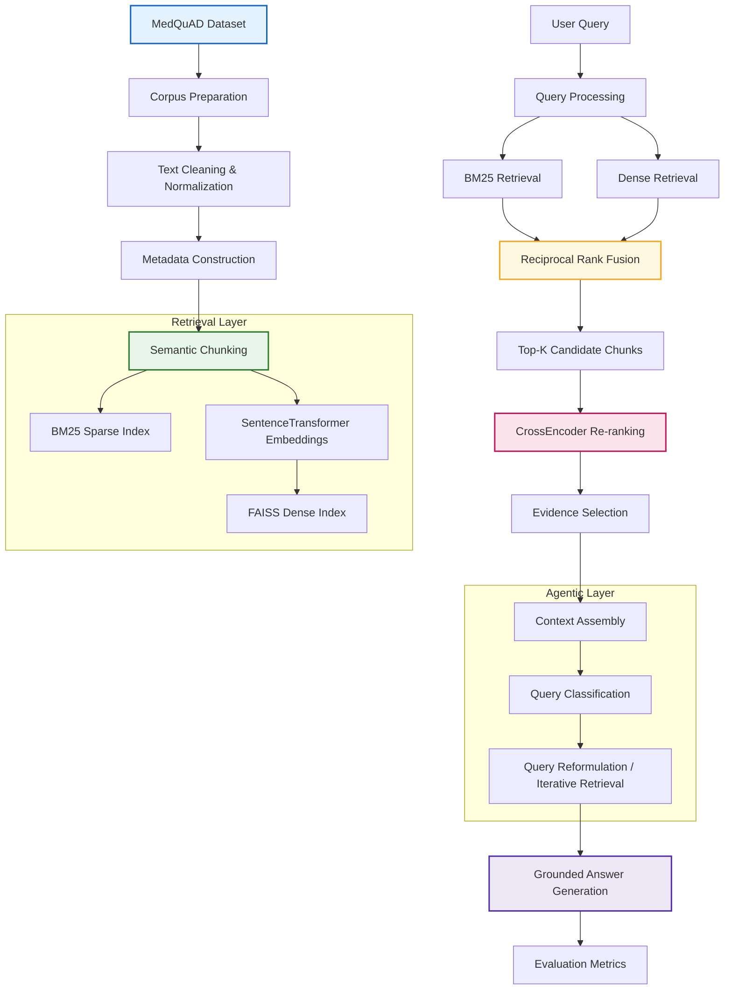
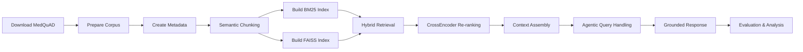

# Advanced Enterprise RAG Assignment

## Course

**Conversational AI**

## Assignment

**Advanced Retrieval-Augmented Generation (RAG) Architecture Design and Evaluation**

## Domain

**Enterprise Healthcare Knowledge Support System**

## Dataset

**MedQuAD (Medical Question Answering Dataset)**

---

## Objective

This project implements an **Advanced Retrieval-Augmented Generation (RAG) pipeline** for a domain-specific healthcare knowledge support assistant. The system is designed to demonstrate the complete RAG workflow required by the assignment, including document processing, retrieval, re-ranking, agentic reasoning, and evaluation.

---

## Current Project Structure

```
advanced-rag-enterprise/
├── Advanced_Enterprise_RAG_Assignment.ipynb
├── data/
│   ├── medquad.parquet
│   ├── processed/
│   │   └── medquad_processed.parquet
│   └── chunks/
│       └── medquad_chunks.parquet
├── models/
│   ├── all-MiniLM-L6-v2/
│   └── ms-marco-MiniLM-L-6-v2/
├── .gitignore
└── README.md
```

---

## Architecture



## 3.1 Overall Advanced RAG Workflow

The following diagram summarizes the complete workflow implemented in this assignment, starting from MedQuAD corpus ingestion and ending with grounded answer generation and evaluation.



This workflow demonstrates the integration of **semantic chunking, hybrid sparse–dense retrieval, cross-encoder re-ranking, and agentic query processing** within a single Advanced RAG architecture.


## Notebook Sections

The implementation is maintained in a **single Jupyter Notebook** for easy execution and submission.

| Section | Description                                  | Status       |
| ------- | -------------------------------------------- | ------------ |
| 1       | Assignment Title and Student Details         | ✅ Completed |
| 2       | Problem Statement                            | ✅ Completed |
| 3       | Dataset Description and Justification        | ✅ Completed |
| 4       | Environment Setup                            | ✅ Completed |
| 5       | Dataset Download and Caching                 | ✅ Completed |
| 6       | Model Loading and Local Caching              | ✅ Completed |
| 7       | Corpus Preparation and Metadata Construction | ✅ Completed |
| 8       | Task 1 – Chunking Strategies                 | ✅ Completed |
| 9       | Task 2 – Hybrid Retrieval                    | ✅ Completed |
| 10      | Task 3 – Re-ranking and Context Assembly     | ✅ Completed |
| 11      | Task 4 – Agentic RAG Workflow                | ✅ Completed |
| 12      | Task 5 – Evaluation Framework                | ✅ In Progress |
| 13      | Limitations and Future Improvements          | ⏳ Pending    |
| 14      | Final Conclusion                             | ⏳ Pending    |
| 15      | References                                   | ⏳ Pending    |

---

## Completed Implementation Details

### Dataset Handling

* MedQuAD dataset downloaded from Hugging Face
* Local **Parquet caching** implemented to avoid repeated downloads
* Dataset inspection and statistics generated

### Model Management

* `sentence-transformers/all-MiniLM-L6-v2` (dense embeddings)
* `cross-encoder/ms-marco-MiniLM-L-6-v2` (re-ranking)
* Local model caching enabled for faster notebook reruns

### Corpus Preparation

* Text cleaning and normalization
* Unified document representation created
* Enterprise-style metadata fields added:

  * `document_id`
  * `document_type`
  * `domain`
  * `knowledge_source`
  * `access_level`

### Chunking Strategies Implemented

#### 1. Fixed-Size Chunking

* Equal-sized character chunks
* Baseline retrieval representation

#### 2. Sliding-Window Chunking

* Overlapping chunks with configurable overlap
* Preserves cross-boundary context

#### 3. Semantic Chunking (**Selected Primary Strategy**)

* Sentence-boundary-aware chunking
* Preserves semantic coherence
* Better suited for healthcare question-answering scenarios
* Used as the **primary retrieval representation** for subsequent tasks

---

## Semantic Chunking Decision

After comparing all three chunking approaches, **semantic chunking** was selected as the primary strategy because it produces more coherent and contextually complete retrieval units for medical knowledge documents. Sliding-window chunking is retained as a **baseline comparison strategy** for experimental analysis.

---

## Artifacts Generated So Far

| Artifact                                   | Purpose                   |
| ------------------------------------------ | ------------------------- |
| `data/medquad.parquet`                     | Cached raw dataset        |
| `data/processed/medquad_processed.parquet` | Cleaned enterprise corpus |
| `data/chunks/medquad_chunks.parquet`       | Semantic chunk repository |
| `models/all-MiniLM-L6-v2/`                 | Embedding model cache     |
| `models/ms-marco-MiniLM-L-6-v2/`           | Reranker model cache      |

---

## Pending Work (Tomorrow’s Plan)

### High Priority

#### Section 9 – Hybrid Retrieval

* Build BM25 sparse index
* Generate dense embeddings for semantic chunks
* Create FAISS vector index
* Implement Reciprocal Rank Fusion (RRF)
* Compare BM25 vs Dense vs Hybrid retrieval

#### Section 10 – Re-ranking

* Apply CrossEncoder reranker
* Compare pre- and post-reranking results
* Assemble grounded evidence context

#### Section 11 – Agentic RAG Workflow

* Query classification
* Routing policies
* Query reformulation
* Iterative retrieval workflow
* Failure recovery strategy

#### Section 12 – Evaluation Framework

* Define evaluation queries and metrics
* Compare retrieval and reranking performance
* Validate grounded response quality
* Document analysis and results

---

## Expected Final Features

The completed assignment will include:

* Metadata-aware semantic chunking
* BM25 sparse retrieval
* FAISS dense retrieval
* Hybrid retrieval with Reciprocal Rank Fusion
* Cross-encoder reranking
* Grounded context assembly
* Agentic query routing and reformulation
* Retrieval and generation evaluation metrics
* Comparative analysis and architectural discussion

---

## Environment

* **Python:** 3.10+
* **Execution Mode:** CPU-only Jupyter Notebook
* **Primary Libraries:**

  * `datasets`
  * `sentence-transformers`
  * `faiss-cpu`
  * `rank-bm25`
  * `pandas`
  * `scikit-learn`

---

## Progress Snapshot

**Last notebook sync:** 2026-08-09

**Overall Completion:** **~55%**

Key updates since last README sync:

- Sections 1–8: ✅ Completed
- Sections 9–11: ✅ Completed (Hybrid retrieval, re-ranking, and agentic workflow implemented)
- Section 12: ⚙️ In Progress — evaluation queries defined; retrieval and reranker evaluations are running and partial diagnostics are available in the notebook
- Sections 13–15: ⏳ Pending (analysis write-up, final conclusion, references)

The foundational work (dataset preparation, model caching, metadata construction, semantic chunking, hybrid retrieval, re-ranking, and agentic workflow) is implemented. The remaining work focuses on completing the evaluation analysis and final report polishing.

---

## Next Restart Point

When continuing the project, start directly from:

```
Section 12 – Task 5: Evaluation Framework
```

This section uses the generated `evaluation_queries`, `retrieval_eval_df`, and `rerank_eval_df` artifacts in the notebook for final diagnostics and metric aggregation.
