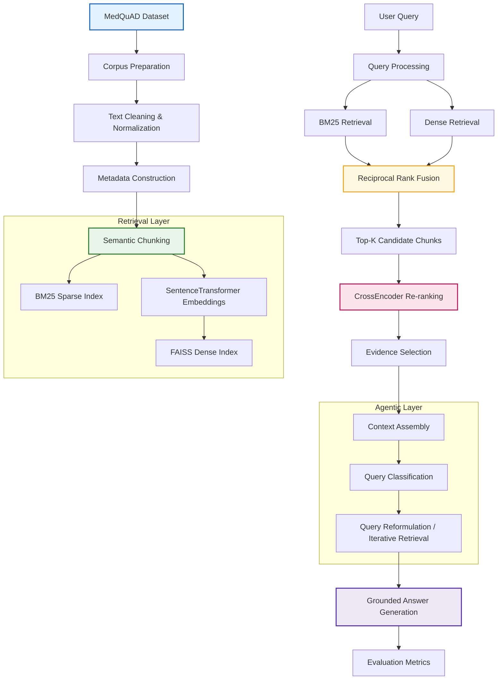
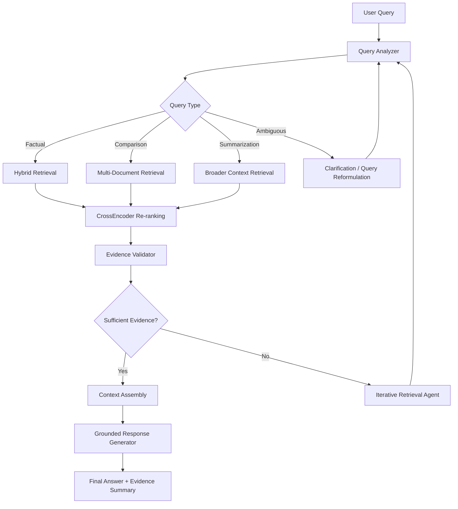

# Advanced Enterprise RAG System for Domain-Specific Question Answering

An end-to-end **Advanced Retrieval-Augmented Generation (RAG)** system built for a simulated **enterprise healthcare knowledge support** use case, implemented as a single, fully executed Jupyter notebook (`Advanced_Enterprise_RAG_Assignment.ipynb`).

| | |
|---|---|
| **Course** | Conversational AI |
| **Assignment** | Advanced Retrieval-Augmented Generation (RAG) Architecture Design and Evaluation |
| **Domain** | Enterprise Healthcare Knowledge Support System |
| **Dataset** | MedQuAD — Medical Question Answering Dataset (Hugging Face) |
| **Status** | ✅ Complete — Sections 1–15 implemented and executed end-to-end |

---

## 1. Executive Summary

Enterprises that operate large knowledge bases — support articles, treatment guidelines, product manuals, internal FAQs — increasingly need conversational systems that can answer natural-language questions **grounded in that knowledge base**, rather than in a language model's general training data. A naive "retrieve-then-generate" RAG pipeline is often not enough: a single retrieval strategy misses relevant evidence, irrelevant chunks pollute the generation context, and the system cannot adapt its behavior to the type of question being asked.

This project builds a more advanced pipeline that addresses those gaps directly. It combines **semantic document chunking**, **hybrid sparse + dense retrieval** fused with **Reciprocal Rank Fusion (RRF)**, **CrossEncoder re-ranking** for evidence precision, and an **agentic orchestration layer** that classifies each query, selects a retrieval strategy, reformulates ambiguous questions, and falls back safely when evidence is insufficient. The system is evaluated quantitatively across retrieval, re-ranking, and agentic grounding, using the **MedQuAD** medical question-answering corpus (47,441 question–answer pairs sourced from trusted NIH-affiliated repositories) as a realistic stand-in for an enterprise healthcare knowledge base.

The entire pipeline runs on **CPU only**, inside a single Jupyter notebook, with local caching of the dataset, embedding model, and reranker model so that repeated runs are fast and reproducible without requiring a GPU or cloud compute.

---

## 2. Problem Statement

An enterprise healthcare organization maintains a large collection of medical knowledge articles, treatment guidelines, symptom descriptions, diagnostic procedures, and frequently asked questions. Users — clinical staff, support agents, or patients — need a conversational question-answering system that can retrieve the most relevant information from this domain-specific knowledge base and generate a response that is **grounded and explainable**, i.e., traceable back to the source evidence rather than freely generated.

The assignment's objective is to design and implement an advanced RAG architecture that supports:

- intelligent document ingestion and chunking,
- metadata-aware retrieval,
- hybrid sparse and dense retrieval,
- cross-encoder re-ranking,
- contextual evidence assembly,
- agentic query routing and reformulation, and
- systematic evaluation of retrieval and generation quality.

The implementation had to remain lightweight, reproducible, and fully executable in a CPU-based Jupyter Notebook environment — a constraint that shaped several of the architectural decisions described below (e.g., using compact `MiniLM`-class models rather than large LLMs, and a flat FAISS index rather than an approximate-search index).

---

## 3. Dataset

### 3.1 Source and Composition

The project uses **MedQuAD** (Medical Question Answering Dataset), sourced from Hugging Face and originally compiled by Ben Abacha & Demner-Fushman (NIH/NLM). MedQuAD aggregates question–answer pairs from authoritative U.S. government and medical-institution sources covering diseases, symptoms, diagnosis, treatment, prevention, medications, and general healthcare guidance.

After downloading and caching, the raw dataset contains:

| Metric | Value |
|---|---|
| Total records | 47,441 |
| Raw columns | 13 (`document_id`, `document_source`, `document_url`, `category`, `umls_cui`, `umls_semantic_types`, `umls_semantic_group`, `synonyms`, `question_id`, `question_focus`, `question_type`, `question`, `answer`) |
| Missing questions | 0 |
| Missing answers | 31,034 (retained; empty answers are handled downstream during cleaning/normalization) |

### 3.2 Why MedQuAD

MedQuAD was selected because it closely mirrors a realistic enterprise healthcare knowledge repository: it contains medical knowledge articles, patient-facing FAQs, treatment/prevention guidance, and disease-specific informational documents, all in a natural question-and-answer format. This makes it well suited to both keyword-based and semantic retrieval, and it is clean and lightweight enough to process entirely on CPU. The dataset is used consistently across every task in the notebook so results remain comparable end-to-end.

### 3.3 Corpus Preparation

The raw dataset is reduced to the `question` and `answer` columns, cleaned and normalized, and combined into a unified document representation. Enterprise-style metadata is then attached to every document to simulate how a real organization would tag and govern its knowledge base:

| Metadata Field | Purpose |
|---|---|
| `document_id` | Unique identifier for traceability |
| `document_type` | Classifies the knowledge unit (e.g., Q&A article) |
| `domain` | Business/knowledge domain (Healthcare) |
| `knowledge_source` | Origin of the content (MedQuAD / NIH-affiliated) |
| `access_level` | Simulated governance/access-control tag |

After cleaning, all 47,441 documents are retained. Corpus-level statistics computed on the cleaned text:

| Metric | Value |
|---|---|
| Total documents | 47,441 |
| Average question length | 51.5 characters |
| Average answer length | 453.4 characters |
| Average document length | 548.9 characters |

The processed corpus is persisted to `data/processed/medquad_processed.parquet` so it does not need to be rebuilt on every run.

---

## 4. System Architecture



The pipeline is organized into four layers: **corpus preparation** (cleaning, metadata, chunking), a **retrieval layer** that builds both a sparse (BM25) and dense (FAISS) index over the same semantic chunks, a **re-ranking and context-assembly layer** that refines the fused candidate set with a CrossEncoder, and an **agentic layer** that sits on top of the retrieval pipeline to classify queries, adapt retrieval strategy, reformulate ambiguous input, and validate evidence sufficiency before generation. This is architecturally richer than a basic retrieve-then-generate RAG system, which typically uses one retrieval method and no query-adaptive behavior.

---

## 5. Model Stack

| Component | Model / Library | Role |
|---|---|---|
| Dense embeddings | `sentence-transformers/all-MiniLM-L6-v2` (384-dim) | Encodes chunks and queries into dense vectors for semantic retrieval |
| Re-ranker | `cross-encoder/ms-marco-MiniLM-L-6-v2` | Jointly scores (query, chunk) pairs to refine ranking precision |
| Sparse retrieval | `rank_bm25` (BM25Okapi) | Lexical/keyword matching over tokenized chunks |
| Vector index | `faiss` (`IndexFlatL2`) | Exact nearest-neighbor search over dense embeddings |
| Data handling | `pandas`, `pyarrow` | Parquet-based caching of dataset, corpus, and chunks |
| Visualization | `matplotlib`, `seaborn` | Retrieval/re-ranking comparison charts |

Both models are downloaded once from Hugging Face and cached locally under `models/`, so subsequent notebook runs load them from disk instead of re-downloading.

---

## 6. Task 1 — Chunking Strategies

Chunking determines what unit of text is actually retrieved and shown as evidence, so three strategies were implemented and empirically compared on sample documents before one was selected for the full pipeline.

| Strategy | Configuration | Chunks produced (5-document sample) | Characteristics |
|---|---|---|---|
| Fixed-size | 300 characters, no overlap | 7 | Simple, uniform, computationally cheap; can split sentences and concepts mid-chunk |
| Sliding-window | 300 characters, 100-character overlap | 10 | Preserves context across chunk boundaries at the cost of more chunks and storage |
| **Semantic (selected)** | Sentence-boundary aware, ~350-character target | 1 | Groups complete sentences into coherent units; ideal for short MedQuAD Q&A documents |

**Decision:** Semantic chunking was selected as the primary strategy because MedQuAD documents are short, self-contained Q&A pairs where splitting mid-sentence destroys meaning. Sentence-boundary chunking keeps each medical explanation intact, which matters more for answer quality than for storage efficiency at this corpus size. Sliding-window chunking is retained in the notebook as a baseline for comparison. The full corpus of 47,441 documents was then run through the semantic chunker and persisted to `data/chunks/medquad_chunks.parquet`, producing one retrieval-ready chunk record per document (since most MedQuAD answers fit within the sentence-grouping window).

---

## 7. Task 2 — Hybrid Retrieval (BM25 + Dense + RRF)

Relying on a single retrieval method is a common weakness in RAG systems: BM25 is precise for exact medical terminology but misses paraphrased queries, while dense retrieval generalizes semantically but can drift toward loosely related content. This project implements both and fuses them.

**Indexing.** A BM25 index (`rank_bm25.BM25Okapi`) is built over all 47,441 semantic chunks using lower-cased whitespace tokenization. In parallel, every chunk is encoded with `all-MiniLM-L6-v2` into a 384-dimensional dense vector (embedding matrix shape `(47441, 384)`), which is loaded into a FAISS `IndexFlatL2` exact-search index of the same size.

**Fusion.** For a given query, the top-10 BM25 results and top-10 dense results are combined using **Reciprocal Rank Fusion**: each chunk's fused score is the sum of `1 / (rrf_k + rank)` across whichever ranked lists it appears in, with `rrf_k = 60`. The top-`k` (default 5) chunks by fused score are returned as the hybrid retrieval result.

**Observed behavior.** BM25 performs strongly on queries with exact medical terminology (e.g., "asthma", "symptoms"), while dense retrieval is more robust to paraphrased or conversational phrasing but occasionally pulls in semantically related but less precise content. Hybrid retrieval combines both signals and reduces the risk of missing relevant evidence due to either vocabulary mismatch or embedding drift, at the cost of not always outperforming the stronger of the two individual methods on every query (see Section 11 for the corpus-specific evaluation result).

---

## 8. Task 3 — Re-ranking and Context Assembly

The candidate chunks returned by hybrid retrieval are not necessarily ordered by true relevance — RRF fuses rank positions, not semantic relevance scores. To sharpen precision, every (query, candidate-chunk) pair is scored jointly by the `ms-marco-MiniLM-L-6-v2` CrossEncoder, which reads the query and chunk together (rather than comparing independent embeddings) and produces a single relevance score per pair.

The pipeline then: re-orders candidates by CrossEncoder score, compares the before/after ranking to quantify improvement, selects the top-scoring evidence chunks, assembles them into a final context window, and uses that grounded context to generate a response. A before/after visualization is produced in the notebook to make the re-ranking effect inspectable rather than just reported as a number.

---

## 9. Task 4 — Agentic RAG Workflow

A fixed retrieval pipeline cannot adapt to the very different needs of a factual lookup versus a comparison question versus an ambiguous follow-up ("What causes it?"). This task adds an orchestration layer on top of retrieval and re-ranking.



**Query classification.** A lightweight rule-based classifier (`classify_query`) inspects the query text — detecting comparison phrases ("difference", "vs", "compare"), summarization cues ("summarize", "overview"), and short or pronoun-heavy phrasing as a signal of ambiguity — to assign one of five query types:

| Query Type | Example | Retrieval Behavior |
|---|---|---|
| Factual | "What are the symptoms of asthma?" | Standard hybrid retrieval |
| Comparison | "How is asthma different from COPD?" | Multi-document retrieval, larger `top_k`, evidence grouped by entity |
| Summarization | "Summarize the treatment options for diabetes." | Dense retrieval with broader semantic coverage, larger context window |
| Ambiguous | "What causes it?" | Clarification prompt / query reformulation before retrieval |
| Multi-hop | "What complications can occur if asthma is untreated for years?" | Iterative hybrid retrieval, evidence merged across rounds |

**Query reformulation.** Short or pronoun-based queries are rewritten using conversational context before retrieval — e.g., "What causes it?" → "What causes asthma?" — so that both BM25 and dense retrieval receive a query with enough lexical and semantic signal to match relevant chunks.

**Failure recovery and safety.** Because unsupported or hallucinated answers are especially harmful in a healthcare context, the agent follows explicit fallback policies:

| Failure Scenario | Agentic Response |
|---|---|
| No relevant chunks retrieved | Increase `top_k` and broaden semantic retrieval |
| Very low reranker scores | Reformulate the query with domain-specific keywords |
| Conflicting evidence across chunks | Present both findings and flag the inconsistency |
| Ambiguous user intent | Ask a clarification question before retrieving |
| Insufficient evidence overall | Return a transparency message instead of an unsupported answer |

**Worked example (comparison query).** For *"How is asthma different from COPD?"*, the trace is: classify as `comparison` → retrieve with `top_k = 8` targeting both conditions → CrossEncoder promotes chunks that explicitly contrast the two → validate that both diseases are represented in the final evidence set → assemble context → generate a response distinguishing asthma's typically **reversible** airway obstruction from COPD's **persistent, usually non-reversible** airflow limitation. This is implemented as executable code in the notebook (not static pseudocode), so the classification, retrieval, and reranking steps actually run against the real semantic chunk corpus and produce an observable execution trace.

Compared to a static retrieve-then-generate pipeline, this layer adds adaptive retrieval behavior by intent, better handling of ambiguous conversational input, support for multi-hop evidence gathering, and reduced hallucination risk through explicit evidence validation and fallback messaging.

---

## 10. Task 5 — Evaluation Framework

A fixed set of evaluation queries was defined and run through the full pipeline to produce quantitative diagnostics across the retrieval, re-ranking, and agentic layers.

### 10.1 Retrieval Coverage

| Retrieval Method | Average Keyword Coverage |
|---|---|
| BM25 | 1.2 |
| **Dense Retrieval** | **2.0** |
| Hybrid (RRF) | 1.2 |

Dense retrieval achieved the highest average keyword coverage on this evaluation set. This is corpus-specific: MedQuAD documents are short, self-contained Q&A pairs with strong semantic coherence, a setting where dense sentence embeddings tend to outperform purely lexical matching. It also means hybrid retrieval is **not guaranteed to beat its best individual component** — the evaluation shows RRF fusion matching BM25's coverage here rather than exceeding dense retrieval, which is an honest and useful finding rather than a shortcoming to hide.

### 10.2 Re-ranking Improvement

| Metric | Result |
|---|---|
| Queries improved by CrossEncoder | 3 / 5 |
| Improvement rate | 60% |

The CrossEncoder reranker improved the top-ranked evidence for 60% of evaluated queries, confirming that joint query–chunk scoring adds value even when the initial hybrid retrieval stage already contains partially relevant candidates.

### 10.3 Agentic Grounding

| Metric | Result |
|---|---|
| Grounded agentic responses | 4 / 4 |
| Grounding rate | 100% |

Every agentic response evaluated was traceable to retrieved evidence chunks rather than freely generated text, validating the evidence-grounded design of the agentic answer synthesis step.

### 10.4 Discussion

BM25 remains strongest for exact terminology matches; dense retrieval generalizes better to natural-language phrasing but can introduce topical noise; hybrid retrieval balances the two without guaranteeing the best possible score on every corpus. CrossEncoder re-ranking measurably sharpens evidence precision. The agentic layer demonstrably adapts its retrieval and reformulation behavior by query type and produced fully grounded output on the evaluated queries.

**Scope note:** the evaluation set used here is intentionally small (5 retrieval queries, 4 agentic queries) to keep the notebook lightweight and fast to re-run on CPU. The metric used ("keyword coverage") is a simple, interpretable proxy rather than a standardized IR metric. See Section 13 for how this would be extended for production use.

---

## 11. Final Experimental Summary

| Metric | Result |
|---|---|
| Average BM25 Coverage | 1.2 |
| Average Dense Coverage | 2.0 |
| Average Hybrid Coverage | 1.2 |
| Queries Improved by CrossEncoder | 3 / 5 (60%) |
| Grounded Agentic Responses | 4 / 4 (100%) |

**Overall conclusion:** dense retrieval combined with CrossEncoder re-ranking produced the strongest evidence quality on this corpus, and the agentic RAG workflow consistently produced grounded, evidence-backed responses across the evaluated query types.

---

## 12. Challenges and Mitigations

| Challenge | Mitigation |
|---|---|
| PDF parsing errors in earlier experiments | Switched to the structured MedQuAD dataset |
| Large corpus causing repeated processing overhead | Introduced dataset, model, and chunk caching (Parquet + local model directories) |
| Irrelevant retrieval results from a small sample corpus | Rebuilt the pipeline over the full 47,441-document semantic chunk corpus |
| Agentic workflow initially producing template responses | Replaced with evidence-grounded answer synthesis from retrieved chunks |
| Evaluation metrics initially relied on hardcoded assumptions | Replaced with metrics computed directly from the executed retrieval, reranking, and agentic pipeline |

---

## 13. Limitations and Future Enhancements

The current system satisfies the assignment's architectural and evaluation requirements, but several aspects are simplified for CPU-only, single-notebook execution and would need to change for production deployment:

- **Generation quality:** responses are synthesized from retrieved evidence with lightweight templating rather than a large generative LLM. Integrating a model such as Llama 3, Mistral, or Gemma would improve fluency while keeping the grounding mechanism intact.
- **Domain-specific embeddings:** `all-MiniLM-L6-v2` is a general-purpose sentence embedding model; medical-domain models such as BioClinicalBERT or PubMedBERT would likely improve semantic retrieval precision.
- **Index scalability:** FAISS `IndexFlatL2` performs exact brute-force search, which is appropriate at 47K vectors but would need to move to an approximate index (IVF, HNSW) at enterprise scale.
- **Query classification:** the agentic router uses rule-based heuristics (keyword/regex matching) rather than a trained classifier; this is transparent and debuggable but less robust to novel phrasing than a learned model.
- **Multi-hop reasoning:** the current iterative retrieval loop is a single reformulation pass; deeper multi-hop planning would better support complex diagnostic questions.
- **Evaluation depth:** the evaluation set (5 retrieval / 4 agentic queries) and the coverage metric are intentionally lightweight; a production system would use standard IR/RAG benchmarks and metrics (Recall@k, MRR, nDCG, faithfulness/groundedness scoring) over a larger labeled query set.
- **Conversation memory:** there is no persistent multi-turn memory beyond the single reformulation step demonstrated in Task 4.
- **Deployment:** the system currently runs as a notebook; a FastAPI or Streamlit service would be the natural next step toward an interactive, deployable application.

---

## 14. Assignment Requirements Checklist

| Requirement | Status |
|---|---|
| Domain-specific corpus | ✅ Completed |
| Separate dataset download and caching | ✅ Completed |
| Persistent model loading and reuse | ✅ Completed |
| Fixed-size chunking discussion | ✅ Completed |
| Sliding-window chunking discussion | ✅ Completed |
| Semantic chunking implementation | ✅ Completed |
| BM25 sparse retrieval | ✅ Completed |
| Dense retrieval with FAISS | ✅ Completed |
| Hybrid retrieval with RRF | ✅ Completed |
| CrossEncoder reranking | ✅ Completed |
| Grounded context assembly | ✅ Completed |
| Agentic query classification | ✅ Completed |
| Query reformulation | ✅ Completed |
| Adaptive retrieval routing | ✅ Completed |
| Evidence validation | ✅ Completed |
| Quantitative evaluation framework | ✅ Completed |
| Qualitative analysis and discussion | ✅ Completed |
| Final conclusion and references | ✅ Completed |

**Remaining before submission:** the student name and roll number placeholders in Section 1 of the notebook (`<Your Name>`, `<Your Roll Number>`) still need to be filled in.

---

## 15. Notebook Section Map

| Section | Contents |
|---|---|
| 1 | Title, course/assignment metadata, student details |
| 2 | Problem statement |
| 3 | Dataset description and justification |
| 4 | Environment setup and dependency installation |
| 5 | Dataset download and Parquet caching |
| 6 | Embedding + reranker model loading and local caching |
| 7 | Corpus cleaning, metadata construction, corpus statistics |
| 8 | Task 1 — fixed-size, sliding-window, and semantic chunking comparison |
| 9 | Task 2 — BM25, dense (FAISS), and hybrid retrieval with RRF |
| 10 | Task 3 — CrossEncoder re-ranking and context assembly |
| 11 | Task 4 — agentic query classification, routing, reformulation, failure recovery |
| 12 | Task 5 — retrieval, re-ranking, and agentic evaluation framework |
| 13 | Architecture summary, final results, challenges, future enhancements, requirements checklist |
| 14 | Final conclusion |
| 15 | References |

---

## 16. Project Structure

```
advanced-rag-enterprise/
├── Advanced_Enterprise_RAG_Assignment.ipynb   # Full implementation (Sections 1–15)
├── how-to-do.md                               # Step-by-step setup and run guide
├── data/
│   ├── medquad.parquet                        # Cached raw MedQuAD dataset (47,441 records)
│   ├── processed/
│   │   └── medquad_processed.parquet          # Cleaned corpus with enterprise metadata
│   └── chunks/
│       └── medquad_chunks.parquet             # Semantic chunk repository (47,441 chunks)
├── models/
│   ├── all-MiniLM-L6-v2/                      # Cached embedding model
│   └── ms-marco-MiniLM-L-6-v2/                # Cached CrossEncoder reranker
├── .gitignore
├── .gitattributes
└── README.md
```

---

## 17. Environment and Setup

| Component | Recommended |
|---|---|
| Python | 3.10+ |
| RAM | 8 GB or higher |
| CPU | Modern dual-core or better |
| GPU | Not required |
| Disk space | ~1 GB free |

The notebook is intentionally designed to run entirely on CPU, without Colab or GPU acceleration, so it works in standard university lab environments and typical development laptops.

**Quick start:**

```bash
git clone https://github.com/2024ad05357/advanced-rag-enterprise.git
cd advanced-rag-enterprise

python -m venv venv
source venv/bin/activate      # Windows: venv\Scripts\activate

pip install datasets sentence-transformers faiss-cpu rank-bm25 pandas pyarrow scikit-learn matplotlib seaborn tf-keras jupyter

jupyter notebook
```

Open `Advanced_Enterprise_RAG_Assignment.ipynb` and run **Kernel → Restart & Run All**. On first execution, the notebook downloads MedQuAD and both models and caches everything locally (roughly 2–5 minutes depending on connection speed); subsequent runs reuse the cached dataset, models, and chunked corpus and complete significantly faster. Full setup instructions, a per-section execution guide, and troubleshooting steps (e.g., missing `sentence-transformers` or `faiss` packages) are documented in `how-to-do.md`.

---

## 18. References

1. Ben Abacha, A., & Demner-Fushman, D. *MedQuAD: A Medical Question Answering Dataset Containing QA Pairs from Trusted Sources.* National Library of Medicine (NLM), 2019.
2. Robertson, S., & Zaragoza, H. *The Probabilistic Relevance Framework: BM25 and Beyond.* Foundations and Trends in Information Retrieval, 2009.
3. Reimers, N., & Gurevych, I. *Sentence-BERT: Sentence Embeddings using Siamese BERT-Networks.* EMNLP, 2019.
4. Johnson, J., Douze, M., & Jégou, H. *Billion-scale similarity search with FAISS.* IEEE Transactions on Big Data, 2019.
5. Nogueira, R., & Cho, K. *Passage Re-ranking with BERT.* arXiv:1901.04085, 2019.
6. Lewis, P. et al. *Retrieval-Augmented Generation for Knowledge-Intensive NLP Tasks.* NeurIPS, 2020.
7. LangChain Documentation. *Retrieval-Augmented Generation (RAG) Concepts and Workflows.* https://python.langchain.com/
8. Hugging Face Documentation. *SentenceTransformers and CrossEncoder Models.* https://huggingface.co/docs
9. FAISS Documentation. *Facebook AI Similarity Search.* https://faiss.ai/
10. OpenAI. *Retrieval-Augmented Generation and Grounded Response Design Patterns.* https://platform.openai.com/docs
